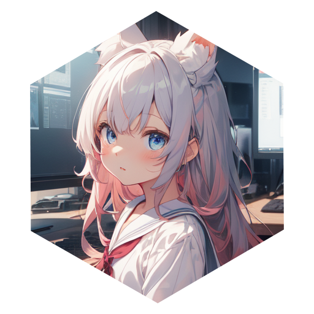

<h1 align="center">
    <br>
    auto-pixai
</h1>

<p align="center">
    <a href="https://github.com/Mr-Smilin/auto-pixai/blob/main/LICENSE"></a>
    <a href="https://github.com/Mr-Smilin/auto-pixai"></a>
    <a href="https://hub.docker.com/r/smile0301/auto-pixai"></a>
</p>

自動領取 pixai.art 獎勵

## 如何開始

```
docker pull smile0301/auto-pixai
docker run -e LOGINNAME=<你的帳號> -e PASSWORD=<你的密碼> --name <container-name> smile0301/auto-pixai
```

`container-name` 依喜好命名，標示處一致即可。

### 手動操作

```
// 手動啟動容器
docker start <container-name>
// 手動關閉容器
docker stop <container-name>
// 查看容器狀態
docker inspect <container-name>
```

<br>

## 關於帳號跟密碼

如果是第三方登入，沒有帳號跟密碼

請訪問 [個人頁面](https://pixai.art/profile/edit)

### https://pixai.art/profile/edit


可以在此處設定帳號跟密碼，帳號的修改需要收取驗證信。

<br>

## 手動裝配

如果不想使用 `docker hub`，可進行手動配置

```
// build Docker Image
docker build -t <image_name> .
// build Docker Container
docker run -e LOGINNAME=<你的帳號> -e PASSWORD=<你的密碼> --name <container-name> <image-name>
```
